[M8x18 screws]: Parts.yaml#M8x18Screw
[M8x18 countersunk screws]: Parts.yaml#M8x18CountersunkScrew
[M8x20 countersunk screws]: Parts.yaml#M8x20CountersunkScrew
[M6x20 screws]: Parts.yaml#M6x20Screw
[M6x20 countersunk screws]: Parts.yaml#M6x20CountersunkScrew
[M6x30 screws]: Parts.yaml#M6x30Screw
[M6 screw nuts]: Parts.yaml#HexagonNut_M6
[M5x20 screws]: Parts.yaml#M5x20Screw
[M5x20 countersunk screws]: Parts.yaml#M5x20CountersunkScrew
[M5x30 screws]: Parts.yaml#M5x30Screw
[Hexagon nuts, M5]: Parts.yaml#HexagonNut_M5
[Slot nuts, M8]: Parts.yaml#SlotNut_M8
[Slot nuts, M5]: Parts.yaml#SlotNut_M5
[Distance plate 1mm]: Parts.yaml#DistancePlate1mm_TBR20UU
[Aluminum frame (40x80x800)mm³]: Parts.yaml#AluminumFrame_40x80x800
[Aluminum frame (40x80x880)mm³]: Parts.yaml#AluminumFrame_40x80x880
[Aluminum frame (40x40x800)mm³]: Parts.yaml#AluminumFrame_40x40x800
[Angles, 40x80]: Parts.yaml#Angle_40x80
[Angles, 40]: Parts.yaml#Angle_40
[Aluminum plate 1]: Parts.yaml#AluminumPlate_1
[Aluminum plate 2]: Parts.yaml#AluminumPlate_2
[Aluminum plate 3]: Parts.yaml#AluminumPlate_3
[Aluminum plate 4]: Parts.yaml#AluminumPlate_4
[Aluminum plate 5]: Parts.yaml#AluminumPlate_5
[Aluminum plate 6]: Parts.yaml#AluminumPlate_6
[Aluminum plate 7]: Parts.yaml#AluminumPlate_7
[Aluminum plates 8 & 9]: Parts.yaml#AluminumPlates_8_9
[Linear bearing, TBR20UU]: Parts.yaml#LinearBearing_TBR20UU
[Supported rail, TBS20]: Parts.yaml#SupportedRail_TBS20
[Motor coupler]: Parts.yaml#MotorCoupler_D25L30_8_8
[Easy-Mechatronics System]: Parts.yaml#EasyMechatronics
[Ballscrew & spindle nut block]: Parts.yaml#BallscrewSpindleNutBlock_SFU1605_DM_652mm
[Motor holder and fixed bearing]: Parts.yaml#MotorHolderFixedBearing_FLB20_3200
[Floating bearing]: Parts.yaml#FloatingBearing_LLB20_6200

# COSI-Measure v1.0
## Mechanical Assembly

### Revision History

| Rev. | Date (YYYY-MM-DD) | Description of Change | Author/Contributors           |
|------|-------------------|-----------------------|-------------------------------|
| 1.0  | 2017-08-29        | Initial version       | Haopeng Han, Lukas Winter     |
| 1.1  | 2018-08-24        | Revised version       | Lukas Winter                  |

### Notes

Please find below the documentation to assemble the mechanical components of COSI Measure, a 3D multipurpose measurement system [1]. If you find any flaws or have any questions/suggestions regarding this document or project, please let us know at lukas.winter@ptb.de. Improving the quality of this work and its documentation makes it easier for others to reproduce and build upon this work.

  Documentation published describing Hardware is licensed under the CERN OHL v.1.2. You may redistribute and modify this documentation under the terms of the CERN OHL v.1.2. (http://ohwr.org/cernohl) unless otherwise stated.

  This documentation is distributed **WITHOUT ANY EXPRESS OR IMPLIED WARRANTY**, INCLUDING OF MERCHANTABILITY, SATISFACTORY QUALITY AND FITNESS FOR A PARTICULAR PURPOSE. Please see the CERN OHL v.1.2 for applicable conditions.

  If you find COSI Measure useful in your work, please cite this paper:

  [1] Han H, Moritz R, Oberacker E, Waiczies H, Niendorf T, and Winter L, "Open Source 3D Multipurpose Measurement System with Submillimetre Fidelity and First Application in Magnetic Resonance," *Scientific Reports*, 7:13452, 2017.

### Required Tools:

- Socket screw keys for M5, M6, M8

{{BOM}}

##  Assemble the aluminum frames {pagestep}

**Insert Slot Nuts into Frames:**

- Take 2 x  [Aluminum frame (40x80x800)mm³]{Qty: 2} and insert 4 x [Slot nuts, M8]{Qty: 4} at each end of the frames.

  
*Figure 3: Inserting slot nuts at each end of the frame.*

- Add an additional [Slot nuts, M8]{Qty: 1} in the perpendicular slot of each frame.

  
*Figure 4: Adding an additional slot nut in the perpendicular slot of the frame.*

**Attach Angles to Frames:**

- Fix the [Angles, 40x80]{Qty: 4} to these two aluminum frames using [M8x18 screws]{Qty: 16}.

**Prepare Remaining Frames:**

- Insert [Slot nuts, M8]{Qty: 4} at the top end of each of the remaining four [Aluminum frame (40x80x800)mm³]{Qty: 4}.

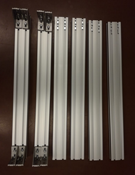  
*Figure 5: Inserting slot nuts at the top of the remaining frames.*

**Assemble the Frame Structure:**

- Attach the remaining frames to the angles using [M8x18 screws]{Qty: 16}.

  
*Figure 6: Frame structure assembled after attaching remaining frames to angles.*

## Connect the 40x40 aluminum frames {pagestep}

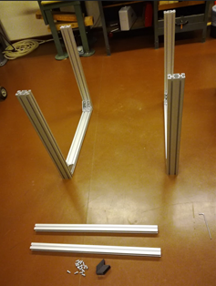  
*Figure 7: Diagram for Step 2.*

**Insert Slot Nuts into 40x40 Frames:**

- Insert [Slot nuts, M8]{Qty: 2} on each side of each [Aluminum frame (40x40x800)mm³]{Qty: 2}.

  
*Figure 8: Inserting slot nuts into the aluminum frame.*

**Prepare Vertical Frames:**

- Insert a [Slot nuts, M8]{Qty: 1} at each corner into the vertical [Aluminum frame (40x80x800)mm³]{Qty: 4} from Step 1. (See Figure 7)

**Attach 40x40 Frames to Structure:**

- Screw the two [Aluminum frame (40x40x800)mm³]{Qty: 2} to the structure using the [Angles, 40]{Qty: 8} and [M8x18 countersunk screws]{Qty: 16}.

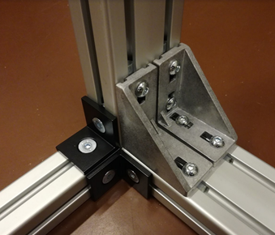  
*Figure 9: Attaching the 40x40 frames to the structure using angles.*

## Prepare for the top frame assembly {pagestep}

**Insert Slot Nuts into Standing Structure:**

- Insert [Slot nuts, M8]{Qty: 5} at the top of two frames of the standing structure.

  
*Figure 10: Inserting 5 slot nuts at the top of the frame.*

  
*Figure 12: Slot nuts inserted at the top of the standing structure.*

- Insert [Slot nuts, M8]{Qty: 4} at the top of the remaining two frames.

  
*Figure 11: Inserting 4 slot nuts at the top of the frame.*

**Note:**

- These slot nuts will be used to attach angles later on.

## Attach the aluminum frames to the top of the structure {pagestep}

**Insert Slot Nuts into Top Frames:**

- Insert [Slot nuts, M8]{Qty: 5} at one end and [Slot nuts, M8]{Qty: 4} at the other end of each [Aluminum frame (40x80x880)mm³]{Qty: 2}.

**Attach Angles to Top Frames:**

- Attach the [Angles, 40x80]{Qty: 8} to these aluminum frames using [M8x18 screws]{Qty: 32}.

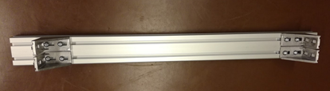  
*Figure 13: Attaching angles to the aluminum frames.*

**Assemble Top Frame Structure:**

- Position the 880mm aluminum frames on top of the standing structure and connect the angles.

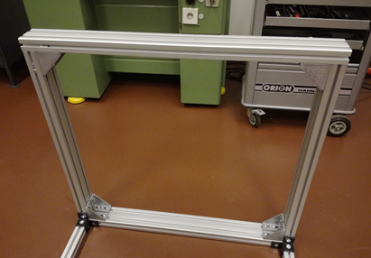  
*Figure 14: Positioning the 880mm frames on top of the structure.*

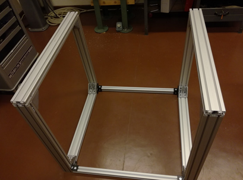  
*Figure 15: Connecting the angles to the standing structure.*

- **Note:** There are two slot nuts on the left side (not on right). These will be used in the next step to connect the remaining aluminum frame (40x40).

##  Add the final aluminum frame {pagestep}

**Insert Slot Nuts into Frame:**

- Insert [Slot nuts, M8]{Qty: 2} at each end of the [Aluminum frame (40x40x800)mm³]{Qty: 1}. (Same as in Step 2)

**Attach Angles and Connect Frame:**

- Attach the [Angles, 40]{Qty: 4} to the aluminum frame using [M8x18 countersunk screws]{Qty: 8}.
- Connect the frame to the existing structure.

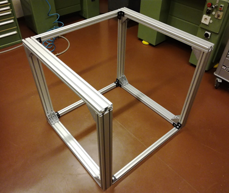  
*Figure 16: Connecting the final 40x40 aluminum frame to the structure.*

## Attach aluminum plates to the frame {pagestep}

**Insert Slot Nuts into Frames:**

- Insert [Slot nuts, M8]{Qty: 6} into the horizontal (x-axis) aluminum frame on top:
  - [Slot nuts, M8]{Qty: 4} on the left
  - [Slot nuts, M8]{Qty: 2} on the right
- Insert [Slot nuts, M8]{Qty: 4} into the vertical (y-axis) aluminum frames:
  - [Slot nuts, M8]{Qty: 2} on the left
  - [Slot nuts, M8]{Qty: 2} on the right
- **Tip:** You can insert them through the bottom and slide them to the top corner.

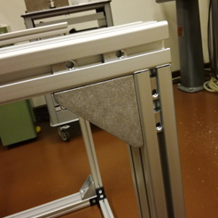  
*Figure 17: Inserting slot nuts into the horizontal frame.*

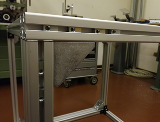  
*Figure 18: Slot nuts inserted into the frames.*

**Attach Aluminum Plates:**

- Attach [Aluminum plate 3]{Qty: 1} to the left corner and [Aluminum plate 4]{Qty: 1} to the right corner using [M8x20 countersunk screws]{Qty: 10}.

## Install the linear bearings and rails {pagestep}

**Insert Slot Nuts into Top Frames:**

- Insert [Slot nuts, M5]{Qty: 24} on the top two (x-axis) 40x80 frames. (2 frames × 2 rails × 6 slot nuts per rail = 24 slot nuts)

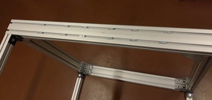  
*Figure 19: Inserting slot nuts on the top frames for the rails.*

**Attach Supporting Rails:**

- Attach the [Supported rail, TBS20]{Qty: 2} to the slot nuts using [M5x20 screws]{Qty: 24}.
- **Important:** Do not tighten the screws yet.

**Install Linear Bearings:**

- Slide the [Linear bearing, TBR20UU]{Qty: 4} onto the supporting rails.

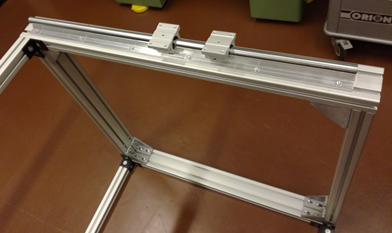  
*Figure 20: Sliding linear bearings onto the supporting rails.*

## Attach the motor and spindle system {pagestep}

**Attach Motor Blocks:**

- Attach the [Motor holder and fixed bearing]{Qty: 2} to the [Ballscrew & spindle nut block]{Qty: 2}.

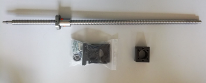  
*Figure 21: Attaching the motor block to the spindle nut block.*

**Assemble Components:**

- Assemble all parts with the [Floating bearing]{Qty: 2} and [Motor coupler]{Qty: 2} as shown below.

  
*Figure 22: Assembling the ballscrew, bearings, and motor holder.*

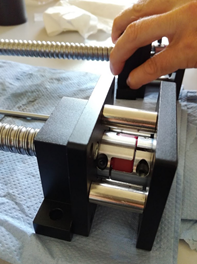  
*Figure 23: Completed assembly of motor and spindle system.*

## Install the Easy-Mechatronics System {pagestep}

**Assemble Mechatronics System:**

- Attach the [Easy-Mechatronics System]{Qty: 1} (z-axis) to [Aluminum plates 8 & 9]{Qty: 2} using [M6x20 screws]{Qty: 12}.

  
*Figure 24: Assembled bearings of the Easy-Mechatronics system with aluminum plates 8 & 9.*

- **Note:** The motor holder is attached to plate 8.

##  Connect the linear axis {pagestep}

**Attach Plate 1 to Linear Bearings:**

- Attach [Aluminum plate 1]{Qty: 1} to the four [Linear bearing, TBR20UU]{Qty: 4} from Step 7.

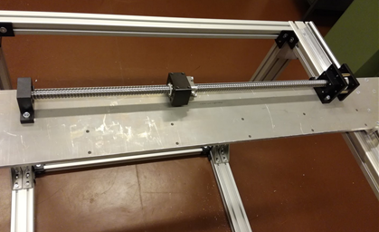  
*Figure 25: Attaching plate 1 to the linear bearings.*

**Attach Linear Axes:**

- Attach one assembled linear axis (y-axis) to [Aluminum plate 1]{Qty: 1}.

**Connect Second Linear Axis:**

- Attach the second linear axis to [Aluminum plate 3]{Qty: 1} (using [M6x20 screws]{Qty: 6}, floating bearing) and [Aluminum plate 4]{Qty: 1} (using [M6x30 screws]{Qty: 2} and [M6 screw nuts]{Qty: 2}, motor holder).

## Install the z-axis linear bearings {pagestep}

**Connect Plates 5 and 6:**

- Connect [Aluminum plate 5]{Qty: 1} with [Aluminum plate 6]{Qty: 1} using [M5x30 screws]{Qty: 4}.

**Connect Plates 6 and 7:**

- Connect [Aluminum plate 6]{Qty: 1} with [Aluminum plate 7]{Qty: 1} using [M5x30 screws]{Qty: 4}.

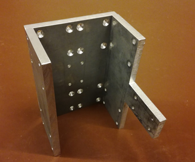  
*Figure 27: Assembled plates 5, 6, and 7.*

**Attach Plates to Linear Bearings:**

- Attach plates 5, 6, and 7 to the linear bearings from the [Easy-Mechatronics System]{Qty: 1} (z-axis) using [M6x20 countersunk screws]{Qty: 16}.
- **Note:** Ensure that the linear bearings are positioned as in  (pointing away from plates 8 & 9). [Aluminum plate 5]{Qty: 1} should point towards the motor holding block.

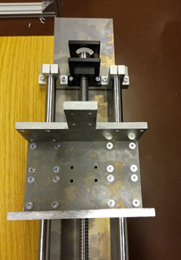  
*Figure 28: Attaching plates 5, 6, and 7 to the linear bearings.*

**Fix Plate 6 to Ballscrew Block:**

- Fix [Aluminum plate 6]{Qty: 1} to the ballscrew block using [M5x20 countersunk screws]{Qty: 4}.

## Complete the assembly by attaching supporting rails {pagestep}

**Install Linear Bearings on Rails:**

- Slide [Linear bearing, TBR20UU]{Qty: 4} onto the [Supported rail, TBS20]{Qty: 2} (2 bearings on top, 2 on bottom).

**Attach Rails to Plate 1:**

- Place one supporting rail on top of [Aluminum plate 1]{Qty: 1} and insert all [M5x30 screws]{Qty: 12} through the holes.
- Place the other supporting rail at the bottom of [Aluminum plate 1]{Qty: 1}, aligning the screws through the holes.
- Fix the rails with the [Hexagon nuts, M5]{Qty: 12}.

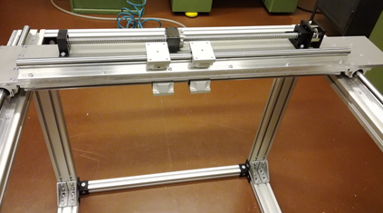  
*Figure 29: Attaching supporting rails to plate 1.*

## Final z-axis assembly {pagestep}

**Attach Z-Axis to Bearings:**

- Attach the assembled z-axis to the [Linear bearing, TBR20UU]{Qty: 4} from Step 12 using [M6x20 countersunk screws]{Qty: 16}.

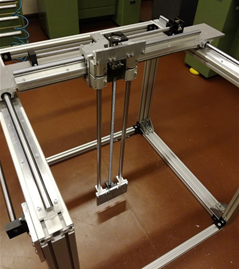  
*Figure 30: Attaching the z-axis to the linear bearings.*

- **Tips:**
  - You may need to loosen the screws connecting plates 5, 6, and 7 slightly if the fit is too tight. Retighten after assembly.
  - Start with the top two bearings, then attach the bottom ones.
  - If there is excess space, use [Distance plate 1mm]{Qty: 4} between the linear bearings and Aluminum plates 5 and 7.

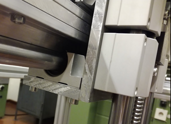  
*Figure 31: Using distance plates between linear bearings and plates if necessary.*

**Fix Plate 5 to Ballscrew Block:**

- Fix [Aluminum plate 5]{Qty: 1} to the ballscrew block of the y-axis using [M5x20 countersunk screws]{Qty: 4}.

  
*Figure 32: Fixing plate 5 to the ballscrew block of the y-axis.*

## Attach the final aluminum plate {pagestep}

**Attach Plate 2 to Plate 1:**

- Attach [Aluminum plate 2]{Qty: 1} to [Aluminum plate 1]{Qty: 1} using [M5x30 screws]{Qty: 4}.

**Fix Plate 2 to Ballscrew Block:**

- Attach [Aluminum plate 2]{Qty: 1} to the ballscrew block from the x-axis using [M5x20 countersunk screws]{Qty: 4}. Optionally, include a [Distance plate 1mm]{Qty: 1} at the ballscrew block.

  
*Figure 33: Attaching plate 2 to plate 1 and fixing to the ballscrew block.*

The assembled configuration should look like this:

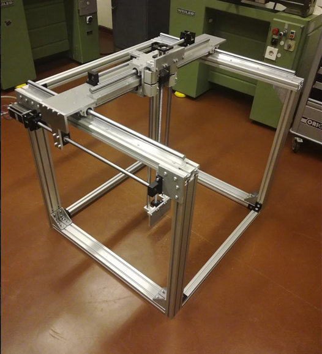  
*Figure 34: Final assembled configuration of COSI Measure.*

### Comments

We are collecting a list of issues and improvements. If you found any errors in the documentation, have ideas/suggestions for improvements, or if you made some modifications, please let us know (you can edit this document with the tracking function and send it to us).

### Known Issues

- The cable chain holder on the z-axis needs some redesign. The current version needs to be manually adjusted.

### Improvements

- Limit switch holder files exist in Sketchup only; an adaptation to FreeCAD is desirable.
- The y-axis motor could be rotated 180°, which would make cabling easier later on.

